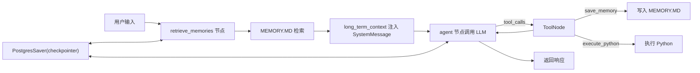

# 给 Agent 装上双层记忆：从会话连续到长期知识沉淀

## 摘要

多数 Agent 项目并不是“不会回答”，而是“记不住”。  
本文基于一个开源 CLI Agent 项目，拆解一套可直接落地的长短期记忆方案：

1. 短期记忆通过 `PostgresSaver + thread_id` 保持会话连续。  
2. 长期记忆通过本地 `MEMORY.MD` 持久化用户偏好和项目事实。  
3. 每轮对话前先检索长期记忆，再注入系统上下文，避免“存了但用不上”。  

这套方案的特点是结构清晰、可读可维护、适合开源项目从 0 到 1 的记忆能力建设。

---

## 一、先说结论：为什么要做“双层记忆”

在实际 Agent 里，记忆问题通常分两类：

1. 同一会话里上下文丢失。  
2. 重启后用户偏好、项目背景全部丢失。  

对应地，我们把记忆拆成两层：

1. 短期记忆：管理“当前会话线程”的状态。  
2. 长期记忆：保存“跨会话仍有价值”的信息。  

这不是概念区分，而是工程边界区分。前者强调时效和连贯，后者强调沉淀和复用。

---

## 二、整体架构



系统中的两条记忆链路：

1. `PostgresSaver` 管短期会话。  
2. `MEMORY.MD` 管长期知识。  

---

## 三、短期记忆实现：`thread_id` 就是会话上下文键

核心思路：同一个 `thread_id` 下，LangGraph 的消息和状态自动连续。

### 关键代码（可直接贴）

```python
# src/agents/cli.py
with PostgresSaver.from_conn_string(settings.postgres_dsn) as checkpointer:
    if hasattr(checkpointer, "setup"):
        checkpointer.setup()

    graph = WBotGraph(
        llm=llm,
        tools=tools,
        memory_store=memory_store,
        retrieve_top_k=settings.retrieve_top_k,
        user_id=settings.user_id,
        checkpointer=checkpointer,
    ).app
```

```python
# src/agents/cli.py
config = {
    "configurable": {
        "thread_id": current_session_id,
    }
}
inputs = {"messages": [HumanMessage(content=user_text)]}
for event in graph.stream(inputs, config=config, stream_mode="values"):
    ...
```

### 会话恢复与新建

```python
# src/agents/cli.py
session_store = SessionStateStore(settings.session_state_file_path)
current_session_id = session_store.load() or settings.session_id
session_store.save(current_session_id)

if user_text.lower() == "/new":
    current_session_id = datetime.now().strftime("cli_session_%Y%m%d_%H%M%S")
    session_store.save(current_session_id)
```

工程收益：

1. CLI 重启后自动恢复上次会话。  
2. `/new` 一键开启新上下文，避免线程污染。  

---

## 四、长期记忆实现：本地 `MEMORY.MD` 的四段式存储

长期记忆文件结构固定为四个区块：

1. User Information  
2. Preferences  
3. Project Context  
4. Important Notes  

这让记忆“可读可审计”，非常适合开源协作。

### 关键类与模板渲染

```python
# src/agents/memory.py
SECTION_ORDER = [
    "User Information",
    "Preferences",
    "Project Context",
    "Important Notes",
]

SECTION_PLACEHOLDERS = {
    "User Information": "(Important facts about the user)",
    "Preferences": "(User preferences learned over time)",
    "Project Context": "(Information about ongoing projects)",
    "Important Notes": "(Things to remember)",
}
```

```python
# src/agents/memory.py
def _render_template(sections: dict[str, list[str]]) -> str:
    lines: list[str] = [HEADER, "", DESCRIPTION, ""]
    for section in SECTION_ORDER:
        lines.append(f"## {section}")
        lines.append("")
        items = sections.get(section, [])
        if items:
            lines.extend(f"- {item}" for item in items)
        else:
            lines.append(SECTION_PLACEHOLDERS[section])
        lines.append("")
    lines.extend(["---", "", FOOTER, ""])
    return "\n".join(lines)
```

---

## 五、长期记忆写入：工具化、分类型、带压缩

当模型判断“这条信息值得长期保留”时，调用 `save_memory`。

### 工具定义

```python
# src/agents/tools/runtime.py
@tool
def save_memory(text: str, memory_type: str = "experience") -> str:
    doc_id = memory_store.save(user_id=user_id, text=text, memory_type=memory_type)
    if not doc_id:
        return "memory save skipped"
    return f"memory saved, id={doc_id}"
```

### 存储逻辑

```python
# src/agents/memory.py
def save(self, user_id: str, text: str, memory_type: str = "experience") -> str:
    clean_text = " ".join((text or "").strip().split())
    if not clean_text:
        return ""

    section = _map_section(memory_type)
    timestamp = datetime.now(tz=timezone.utc).isoformat(timespec="seconds")
    entry = f"{timestamp} [{memory_type}] {clean_text}"

    with self._lock:
        sections = self._read_sections()
        existing_normalized = {_normalize(item) for item in sections[section]}
        if _normalize(clean_text) in existing_normalized:
            return _stable_id(clean_text)

        sections[section].append(entry)
        self._compress_sections(sections, max_items_per_section=80)
        self._write_sections(sections)

    return _stable_id(entry)
```

### 类型映射

```python
# src/agents/memory.py
def _map_section(memory_type: str) -> str:
    key = (memory_type or "").strip().lower()
    if key in {"preference", "preferences"}:
        return "Preferences"
    if key in {"user", "profile", "user_info"}:
        return "User Information"
    if key in {"project", "context", "task"}:
        return "Project Context"
    return "Important Notes"
```

---

## 六、长期记忆检索：先关键词命中，再 recent 回退

每轮对话开始先走 `retrieve_memories` 节点。

### 检索节点

```python
# src/agents/agent.py
def _retrieve_memories(self, state: AgentState, _: RunnableConfig | None = None) -> dict[str, str]:
    query = _extract_last_user_message(state.get("messages", []))
    if not query:
        return {"long_term_context": ""}

    docs = self._memory_store.retrieve(
        user_id=self._user_id,
        query=query,
        k=self._retrieve_top_k,
    )
    if not docs:
        docs = self._memory_store.retrieve_recent(
            user_id=self._user_id,
            k=self._retrieve_top_k,
        )
        if not docs:
            return {"long_term_context": ""}

    lines = [f"- {doc.page_content}" for doc in docs]
    return {"long_term_context": "\n".join(lines)}
```

### 关键词打分（轻量可解释）

```python
# src/agents/memory.py
def _score_text(text: str, query: str) -> int:
    query = (query or "").strip()
    if not query:
        return 0
    if query in text:
        return max(3, len(query))

    text_l = text.lower()
    tokens = _tokenize(query)
    score = 0
    for token in tokens:
        if token and token in text_l:
            score += len(token)
    return score
```

### 注入到系统上下文

```python
# src/agents/agent.py
memory_context = state.get("long_term_context") or "无"
memory_block = f"已检索到的长期记忆:\n{memory_context}"

messages = [
    SystemMessage(content=system_prompt),
    SystemMessage(content=memory_block),
    *sanitized_history,
]
response = self._llm.invoke(messages)
```

---

## 七、这套方案的优点与边界

### 优点

1. 低门槛，单机可跑，开源友好。  
2. `MEMORY.MD` 可读可审计，便于人工纠错。  
3. 有上限压缩策略，避免无限膨胀。  
4. 检索和注入链路闭环，记忆“存得进也用得上”。  

### 边界与改进建议

1. 当前检索是关键词匹配，不是语义检索。  
2. 去重逻辑对“带时间戳条目”存在语义重复风险。  
3. `threading.Lock` 只保证进程内并发安全。  
4. 单文件存储在多用户场景需要更强隔离策略。  

推荐演进路径：

1. 关键词检索升级为 `BM25 + Embedding` 混合召回。  
2. 记忆去重升级为“内容指纹”级别。  
3. 长期记忆从 Markdown 迁移到结构化存储并保留导出视图。  

---

## 八、可复用的落地原则

1. 长短期记忆必须分层，不要混一个仓。  
2. 长期记忆先追求可维护，再追求高智能。  
3. 每轮检索要有 fallback，避免空上下文。  
4. 给记忆增长设置硬上限。  
5. 记忆链路要可观测，便于调试和回放。  

---

## 结语

如果你正在做自己的 Agent，这套方案非常适合作为第一版记忆系统：

1. 短期靠 `thread_id` 稳住会话连续性。  
2. 长期靠 `MEMORY.MD` 沉淀用户和项目知识。  
3. 检索注入把“存储”变成“可被模型利用的上下文”。  

先把记忆做“对”，再把记忆做“强”，这是更稳的工程路线。
